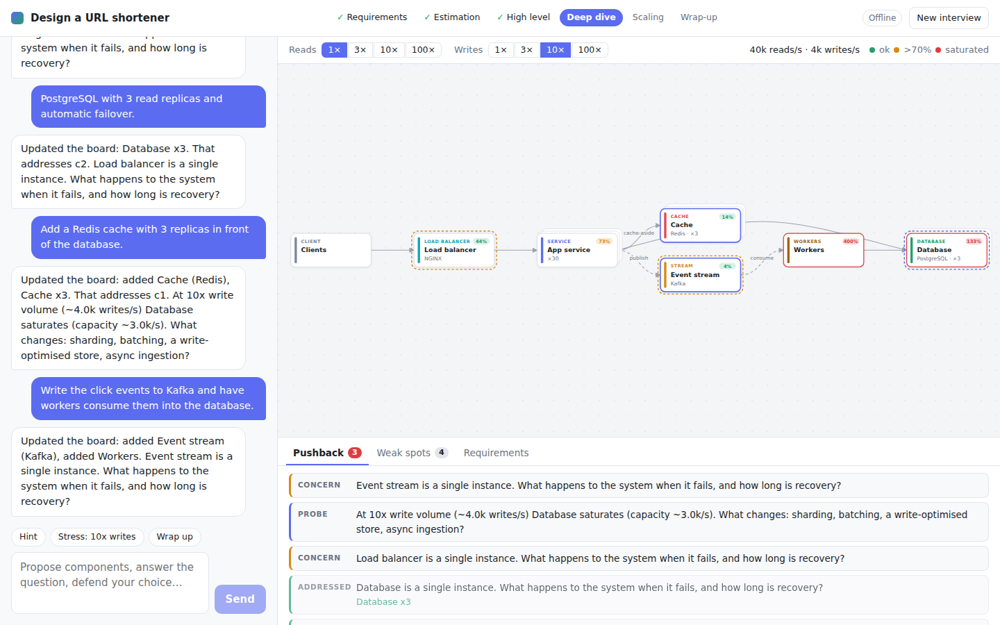

# System Design Interview Tutor

Practice system design interviews against a tutor that builds the architecture **with** you. Give it a prompt like
"design a URL shortener" or "design Discord". It takes you through requirements, estimation, a high-level design, a deep
dive, and scaling. It draws each component on a live diagram as you agree on it and keeps pushing back on your choices,
e.g. _"What happens at 10x write volume?"_



## Features

- **Incremental architecture.** Clients, load balancers, gateways, services, caches, queues/streams, workers, databases,
  object storage, and search all appear on the board as they enter the conversation. Replicas show as stacked cards and
  shards as badges, and async hops are animated dashed edges.
- **Pushback.** The tutor pins pointed questions to the board (probe / concern / critical) and highlights the components
  they're about. It closes them once you've answered well.
- **Load model.** Your scale estimates drive a rough capacity model, and each component shows its estimated utilisation.
  Toggle **Reads/Writes 1× · 3× · 10× · 100×** to watch the design turn red as it saturates. Read replicas help reads but
  not writes, shards help both, and a cache absorbs most database reads.
- **Weak spots.** A rule-based linter flags single points of failure, clients hitting servers directly, read-heavy
  designs with no cache, queues with no consumer, long synchronous call chains, shards without a key, and components
  that are overloaded now or would be at 10x writes. Its findings also go to the tutor as reviewer notes.
- **Two tutor modes:**
  - **Claude** is an adaptive interviewer built on the Claude API with tool use. It edits the diagram through tools,
    streams its replies, and decides where to push based on your answers and the reviewer notes.
  - **Offline** is a scripted, rule-based interviewer that needs no API key. It recognises components and technologies
    in your messages ("nginx in front of 30 app servers, Postgres with 3 read replicas"), wires them up, and pushes back
    using the linter and stress questions.
- Light and dark themes. The diagram switches to a top-to-bottom layout on phones.

## Quick start

Requires Node 20+.

```bash
npm install
export ANTHROPIC_API_KEY=sk-ant-...   # optional; without it the app defaults to offline mode
npm run dev                            # API on :8787, UI on http://localhost:5173
```

Production build:

```bash
npm run build    # bundles the UI into dist/
npm start        # serves the API and the built UI on http://localhost:8787
```

### Configuration

| Variable            | Default                                             | Purpose                                                      |
| ------------------- | --------------------------------------------------- | ------------------------------------------------------------ |
| `ANTHROPIC_API_KEY` | none                                                | Enables the Claude tutor (`ANTHROPIC_AUTH_TOKEN` also works) |
| `TUTOR_MODE`        | `claude` if a key/token is set, otherwise `offline` | Default mode for new sessions (`claude` or `offline`)        |
| `TUTOR_MODEL`       | `claude-opus-5-5`                                   | Model used by the Claude tutor                               |
| `TUTOR_EFFORT`      | `medium`                                            | `low` / `medium` / `high` / `xhigh` / `max`                  |
| `PORT`              | `8787`                                              | API server port                                              |

Set `TUTOR_MODE=claude` if your credentials come from an `ant auth login` profile rather than an environment variable.
You can also pick the mode per interview on the start screen.

## How it works

```
web/  React UI ─── POST /api/sessions/:id/messages ───▶ src/server  (Express, SSE)
        ▲                                                   │
        │   text deltas + design snapshots (SSE)            ▼
        └──────────────────────────────────────── TutorEngine: ClaudeTutor | OfflineTutor
                                                            │
                                                 src/shared: design ops, critic, load model
```

- `src/shared/design.ts` holds the whiteboard state and a pure reducer over `DesignOp`s (add, update, or remove a
  component, connect, set requirements, pin or resolve a challenge). The server and the browser use the same types.
- `src/shared/analysis.ts` holds the capacity model (`computeLoad`) and the rule-based critic (`critique`). The numbers
  are deliberately rough, interview-grade per-node estimates, not benchmarks.
- `src/server/tutor/claude.ts` runs a streaming tool-use loop on the Claude API. Each tool in `tools.ts` maps one-to-one
  onto a `DesignOp` and is validated with zod. Every candidate message carries a snapshot of the whiteboard plus
  reviewer notes, and the history is append-only so the prompt cache stays warm. Server-side refusal fallbacks are on
  (`fallbacks: "default"`).
- `src/server/tutor/offline.ts` is the scripted interviewer.
- Sessions live in memory and expire after 2 hours idle.

## Development

```bash
npm test            # vitest: reducer, load model, critic, tools, Claude loop (fake client), offline tutor, HTTP API
npm run typecheck
npm run format
```
